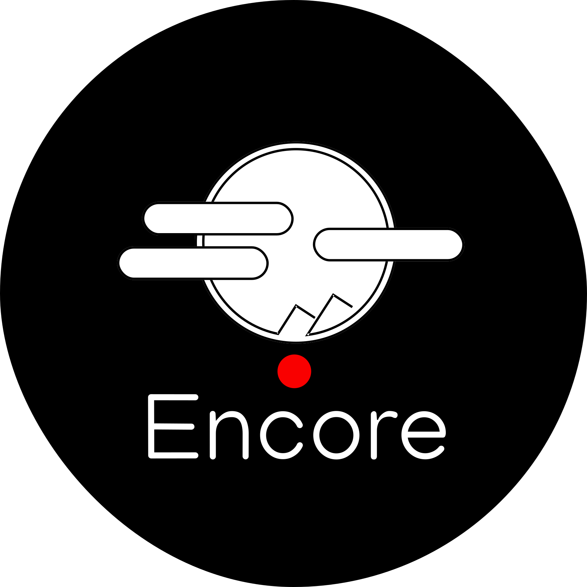

# Encore Ecosystem

  

🔥 A community of people striving to make the world a better place through IT projects using new technologies and developments.

🌍 You can join us and explore our projects! We believe in the power of technology to create a positive impact on society.

💡 Our Values:
- Innovation: We are constantly researching the latest technologies and methods to improve our solutions.
- Collaboration: We are open to collaborating and sharing ideas with like-minded people to achieve great results together.
- Learning: Every endeavor we undertake is an opportunity to learn something new and share knowledge with others.

🚀 Our Projects:
We work on a variety of projects that range from software development to open source initiatives. Here are some of them:
- WebCrane - a version control application for version control between bulk applications
- Flute - a next-generation social network that allows users to experience new emotions

🤝 Join us!
If you're ready to contribute and have a real impact, we'd love to have you in our community. Your ideas and skills could be the key to new perspectives and changing the world!

✨ Contact us:
Feel free to leave your comments, suggestions and ideas in Issues or discussions. Let's make the world a better place together by harnessing the power of technology!